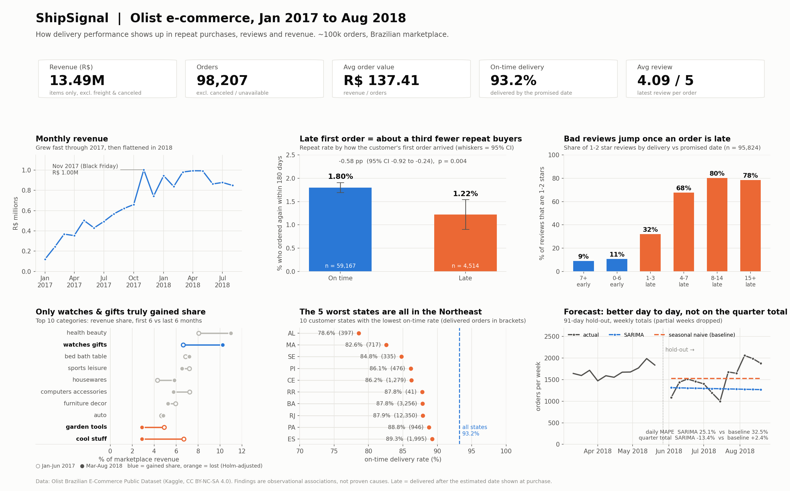
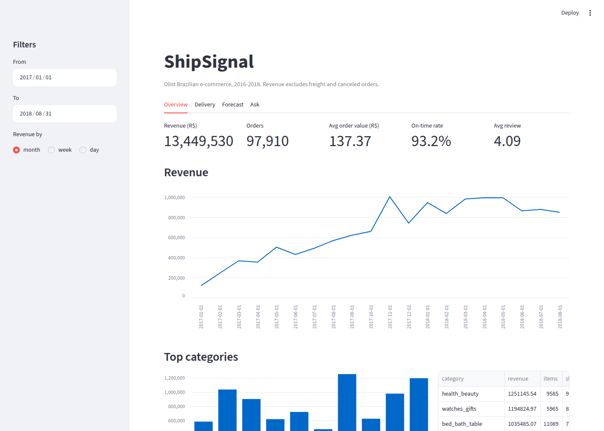

# ShipSignal

Analysis of ~100k orders from Olist (a Brazilian e-commerce marketplace, 2016-2018). I wanted to see how much delivery delays actually hurt a marketplace, so I built the whole thing end to end: a postgres warehouse with dbt, some stats notebooks, a small API + streamlit app, and a local LLM that answers questions about the data in plain english.



Summary of the main findings. The streamlit app below has the interactive version (runs locally, see How to run), and a tableau version is in progress.



## Main findings

- **Late deliveries lose customers.** If a customer's first order came late, they ordered again 1.22% of the time vs 1.80% when it was on time. That's about a third fewer repeat buyers (diff -0.58 pp, 95% CI -0.92 to -0.24, p = 0.004). Still holds after controlling for state, category and order value (odds ratio 0.69). It's observational data though so I can't say late delivery *causes* it.
- **Delays kill reviews.** Every day late is about -0.06 stars. Orders more than a week late get a 1-2 star review around 80% of the time, vs 9% for orders that arrived a week early. Orders split across multiple sellers also score ~1 star lower.
- **Most "growing" categories were just the site growing.** When I looked at share of revenue instead of raw revenue, only watches_gifts actually gained share (6.7% -> 10.3%). cool_stuff and garden_tools lost share.
- **Forecast.** SARIMA on daily orders vs a seasonal naive baseline, on a 91 day holdout. SARIMA was better day to day (MAPE 25.1% vs 32.5%) but worse on the quarter total (-13% vs +2%), so the baseline is honestly fine if you only need the quarterly number. Forecast for the next quarter is ~27,700 orders (no holidays in the model).

Notebooks are in `analysis/`.

## LLM assistant

You ask something like "what was revenue in 2017?", the model (qwen2.5-coder 7b running locally through ollama) writes the SQL, it runs, and you get the answer back. The SQL gets checked first (single SELECT only, allowed tables/columns only, row limit) and runs in a read-only transaction, so it can't modify anything.

I wrote 40 test questions where I know the right answer and compared a few prompt versions:

| prompt | correct |
|---|---|
| just table + column names | 27/40 |
| + column descriptions and business rules | 29/40 |
| + definitions pulled from docs (rag) | 32/40 |
| + a few example questions | 35/40 |

Most of the improvement came from giving it the business definitions (e.g. revenue doesn't include freight), not from it writing better SQL. The remaining misses are things like grouping by month across both years instead of year-month.

## Data issues I found

dbt tests flagged a few things in the raw data:
- 249 orders where payment doesn't match items + freight (probably vouchers / installment interest)
- 8 orders marked delivered but with no delivery date
- review_id isn't unique (814 dupes), and 547 orders have more than one review
- the data basically stops around Aug 21 2018, after that there are only a few stray orders, so I cut the forecast there

## How to run

Need docker, python 3.10+, and ollama if you want the assistant.

1. Download the dataset from [kaggle](https://www.kaggle.com/datasets/olistbr/brazilian-ecommerce) and put the csvs in `data/raw/`
2. Then:

```
make setup
source .venv/bin/activate
make db          # postgres in docker
make warehouse   # load csvs + dbt build
make api         # terminal 1
make app         # terminal 2 -> localhost:8501
```

For the assistant: `ollama pull qwen2.5-coder:7b` then `make eval` to rerun the 40 questions.

Or just `docker compose up --build` for everything.

Tests: `make test`. CI runs ruff, sqlfluff, dbt build and pytest on a small fake dataset since the real data isn't in the repo.

## Stack

postgres, dbt, pandas, statsmodels, matplotlib, fastapi, streamlit, ollama, sqlglot, pytest, docker, github actions

## Notes

- Data is from Olist on Kaggle (CC BY-NC-SA 4.0), not included in the repo.
- Only ~20 months of usable data so the forecast can't learn yearly seasonality (black friday etc).
- TODO: tableau public version of the dashboard, host the streamlit app, try a bigger model for the assistant.
